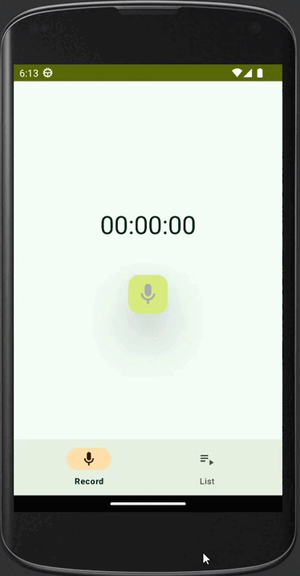

# Приложение "VoiceRecorder" для мобильных устройств под управлением OS Android.

### Приложение выполняет функции:
- Запись звука в файл
- Сохранение файла в памяти устройства
- Прослушивание сохраненного файла
- Удаление файла

### Используемые технологии
- XML/Compose UI
- Androidx navigation
- MVVM architecture
- Dependency injection with Hilt
- Room database
- Media3 library/ExoPlayer

### Demo
